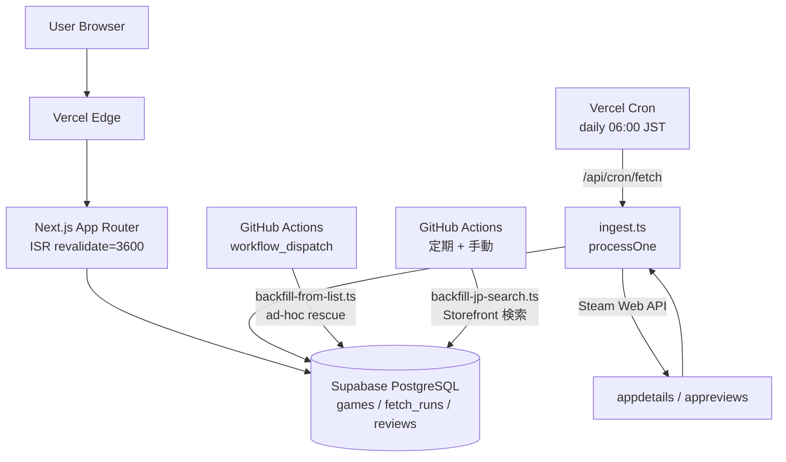

# Steam Pulse JP

**Steam 新作ゲームの日本人プレイヤー向けキュレーション SaaS**

> **Live:** [https://steampulse.jp](https://steampulse.jp)

| 項目 | 内容 |
|---|---|
| ローンチ | 2026-04-30 |
| 状態 | 本番稼働中 |
| 開発者 | 勝部 恭平 (個人開発) |
| GitHub | https://github.com/nassos |

---

## プロジェクト概要

Steam では毎日数十本のゲームがリリースされるが、日本語メディアの速報は大作に偏る。インディータイトルや隠れた良作はそこから漏れる。Steam Pulse JP はそこに個人開発で入り込んだサービスだ。

Steam Web API の `appdetails` + `appreviews` から日本語レビュー数・`jp_text_supported` フラグ・隠れ良作スコアを独自集計し、「本当に日本人プレイヤーが遊んでいるタイトル」を 3 軸 (公式日本語対応 / 日本人プレイヤー人気 / 隠れ良作) でキュレーションする。毎日の自動収集と ISR 配信で鮮度を維持しながら、大手ゲームメディアが扱わないインディータイトルの検索需要を拾いにいく。

---

## 技術スタック

| 領域 | 技術 |
|---|---|
| フロントエンド | Next.js 15 (App Router) / TypeScript / Tailwind CSS |
| バックエンド | Next.js Server Actions / API Routes |
| データベース | Supabase (PostgreSQL + Auth + RLS) |
| AI | OpenAI API (gpt-4o-mini 等、コストを抑制した運用) |
| インフラ | Vercel (ISR + Edge Functions) / GitHub Actions (cron fallback + backfill) |
| 監視・SEO | Google Search Console / GA4 / Vercel Speed Insights |
| 外部 API | Steam Web API (appdetails / appreviews / app list) |

---

## アーキテクチャ図

---

## 実装ハイライト

### 1. cron 自動収集と ISR キャッシュ最適化

Vercel Hobby の 60 秒タイムアウト制約内で `DEFAULT_LIMIT = 8` (5/13 以降 20 に引き上げ予定) で日次取得。ISR `revalidate=3600` で個別ゲームページとジャンルハブを定期再生成し、Server Components + Suspense で TTFB を短縮している。cron の確実性を保つため、GitHub Actions をフォールバックトリガーとして並走させている。

### 2. SEO 設計と効果検証 (Search Console / GA4)

17 指標スコアカードを設計し、フェーズごとに全体 CTR・ジャンル別 CTR・インデックス数の推移を Search Console データで追跡。URL 設計・構造化データ (JSON-LD breadcrumb / FAQ schema) ・サイトマップ管理をセットで実装し、施策 Phase A-G の累計で全体 CTR 0.83% → 1.55% に改善、ジャンル軸の表示数は +875% になった。

### 3. `/jp-friendly/*` 独自集計軸と構造化データ

4 ページ + 9 ジャンルサブページで「日本人プレイヤーが実際に遊んでいる」軸を popular / hidden-gems / new の 3 区分で可視化。5/8 時点で露出 0 件だった「日本語化」クエリが 2 件初露出し、`/jp-friendly/hidden-gems` が Search Console 順位 7.67 で初計測された。

### 4. 構造的取りこぼしの発見と救出インフラ化

DB 235 件でローンチ後、`DEFAULT_LIMIT = 8` + `appid 降順ソート` の組み合わせが中堅 appid 帯の話題作を構造的に取りこぼす設計と判明。`.github/workflows/backfill-from-list.yml` を新設し、GitHub Actions 経由で 162 件を一括救出、DB を 997 件まで拡充した。詳細は後述のストーリー参照。

### 5. AI エージェント協働の運用設計

Claude Code を日常開発の中心に置き、AI 単独で進めて良い範囲と人間確認を必須とする範囲を意思決定マトリクスに明文化している。詳細は後述の「AI 協働の実例」参照。

---

## 技術ストーリー: Crab 救出の一部始終

2026-05-12、「*Everything is Crab* (appid 3526710、2026-05-08 リリース) が DB に登録されていない」という一報が起点になった。

最初は Steam API レスポンスの型違いかと思って Supabase の SQL コンソールを叩いた。違った。次に cron の実行ログを確認した。走ってはいた。Q1 から Q6 まで順に SQL を発行しながら、ようやく原因が「appid の降順ソート + DEFAULT_LIMIT 打ち切り」の複合だと分かった。

原因は (3) と (4) の複合だった。`/api/cron/fetch/route.ts` は appid を降順で処理していたため、直近の超新作 (appid 大) を優先して取り込む一方、`DEFAULT_LIMIT = 8` の打ち切りにより中堅 appid 帯のゲームが毎日取り込みキューから落ち続けていた。Crab のように話題になっても appid がやや古い作品は、この設計では永遠に取り込まれない死角があった。

対応は 2 段階にした。まず即時対処として `.github/workflows/backfill-from-list.yml` を新設し、取りこぼしリストを手動インプットで一括救出する workflow を書いた。次に既存の `backfill-jp-search.ts` を `workflow_dispatch` で流して 162 件を一括取得 (Reviews_DESC で取りこぼし候補を Steam Storefront から再収集)、DB が 835 件から 997 件に拡充されたことを Supabase で確認した。ISR キャッシュのリセットで本番への反映も確認。

根本修正 (DEFAULT_LIMIT を 20 に引き上げ + name pattern による非ゲーム除外) は 5/13 朝の Phase B-1 として計画し、本番コードの変更は翌日に先送りした。「今日動いている本番を夜中に触らない」判断を優先した形だ。

発見してから本番反映まで、その日のセッション 1 本で終わった。約 4 時間。

---

## AI 協働の実例

Claude Code との協働は型ではなく、場面ごとに役割を分担する。最も具体的だったのは Crab 取りこぼし発覚の調査セッションだ。

「次に確認すべき SQL は何か」を毎回 Claude Code に問いながら、自分は結果を読んで判断を返す往復を 1 時間続けた。仮説をゼロから AI に作らせるのではなく、自分の判断に速度をつけるための使い方をしている。SEO 検証手順の設計、ジャンルハブ拡充の仕様書、backfill workflow の yml 生成も同じパターンで、AI が初稿を作って自分が仕様と整合するかを確認してコミットする流れ。

ガバナンス側では、`.company/CLAUDE.md` に AI 単独 OK と人間確認必須の意思決定マトリクスを明文化している。AI が自律的に動いて良い範囲とエスカレーションが必要な範囲を、判断基準一枚で管理する形だ。個人開発で動かしてみて、チームに持ち込んでも通用する設計だと思っている。

---

## 数値で見る成果 (2026-05-12 時点)

| 指標 | ベースライン | 2026-05-12 現在 |
|---|---|---|
| DB ゲーム数 | 235 (2026-04-30 ローンチ時) | 997 |
| 全体 CTR | 0.83% (4/28-5/4 週) | 1.55% (5/5-5/11 週) |
| クリック数 | 5 (4/28-5/4 週) | 35 (5/5-5/11 週) |
| 表示数 | 602 (4/28-5/4 週) | 2,259 (5/5-5/11 週) |
| インデックス入りジャンルページ | 3 (5/5 時点) | 15 (5/12 時点) |
| `/genres/*` 表示数 | 4 (5/5 時点) | 39 (5/12 時点、+875%) |
| `/jp-friendly/*` 初露出ページ | 0 (5/8 ベースライン) | 3/4 ページ |
| 「日本語化」クエリ露出 | 0 (5/8 ベースライン) | 2 件初露出 |

> 計測期間: Google Search Console (プロパティ steampulse.jp) より取得。ローンチ 12 日目時点のスナップショット。

---

## スクリーンショット

> (オーナーが後で追加予定)
>
> 想定: トップページ、ジャンルハブ (`/genres/action`)、個別ゲームページ、Search Console スコアカード

---

## 今後の展開

**近期 (〜5 月末)**: cron の日次取り込み件数を増やし、name pattern フィルタで非ゲームを除外して取りこぼしを減らす。`/jp-friendly/hidden-gems` の snippet 強化で Search Console 順位を上位に押し上げる。ジャンルハブに独自コンテンツセクションを追加。旧 URL から `/games/[slug]` への middleware 301 redirect 実装。

**長期**: AdSense 申請 (コンテンツ量充足後)、ジャンル別ハブの拡張、`/jp-friendly/*` 軸の API 化、pgvector による「雰囲気で探す」検索。

---

## 関連プロジェクト (個人開発)

| SaaS | 概要 | 状態 |
|---|---|---|
| Lumière Tarot | 22 カード SEO ページ + Claude API 解釈生成 | 本番稼働中 (2026-04-29 ローンチ) |
| TechJP Feed | AI 要約付き IT ニュース集約 Android アプリ | Google Play 公開準備中 |
| kosodate-pulse | 子育て情報キュレーション | 基盤稼働中 |
| AI 現場 | AI 副業マッチング LP | インデックス確認中 |

---

## 連絡先

- 開発者: 勝部 恭平
- GitHub: https://github.com/nassos
- 本リポジトリ: https://github.com/nassos/steam-pulse-portfolio (準備中)
- Live URL: [https://steampulse.jp](https://steampulse.jp)
